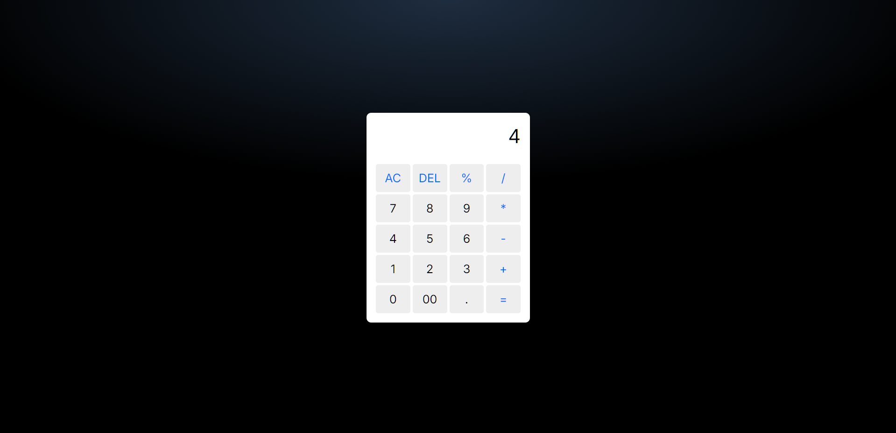

# 🧮 Calculator

A clean, responsive calculator built with vanilla JavaScript. Handles basic arithmetic operations with a modern UI and intuitive button layout.

[Deployed App](https://hanzlafullstack-calculator.vercel.app/) • [GitHub Repo](https://github.com/hanzlafullstack/Calculator)



## Overview

I built this to practice DOM manipulation, event handling, and user input validation. The focus is on clear button interactions, readable code structure, and a mobile-friendly layout that feels natural to use.

## Tech Stack

- HTML5 for structure
- CSS3 with CSS Grid for button layout
- JavaScript (ES6+) for calculation logic and DOM updates
- Google Fonts (Alan Sans) for typography

## Features

- Basic arithmetic operations: addition, subtraction, multiplication, division
- Percentage calculations
- Clear all (AC) and delete last character (DEL) functions
- Decimal number support
- Error handling for invalid expressions
- Responsive grid layout optimized for mobile and desktop
- Clean, modern UI with highlighted operator buttons

## Folder Structure

```
Calculator/
│
├── index.html
├── style.css
├── index.js
└── preview/
    └── screenshot.png
```

## What Went Well

- Clean grid layout using CSS Grid for button organization
- Simple, intuitive button interactions with clear visual feedback
- Error handling prevents crashes when invalid expressions are entered
- Responsive design works well on different screen sizes

## What I'd Improve Next

- Replace `eval()` with a proper expression parser for better security and control
- Add keyboard support for number and operator inputs
- Implement calculation history to show previous operations
- Add support for parentheses and more complex expressions
- Better error messages (e.g., "Division by zero" instead of generic "Error")
- Add animations for button presses and transitions

## What I Learned

- DOM manipulation and event handling with inline event handlers
- Using CSS Grid for creating organized button layouts
- Basic input validation and error handling
- Working with string methods like `slice()` for deleting characters
- Creating a functional UI component from scratch

## Setup

1. Clone the repository:
   ```bash
   git clone https://github.com/hanzlafullstack/Calculator.git
   cd Calculator
   ```
2. Run locally:
   - Open `index.html` directly in your browser, or start a simple server:
     ```bash
     npx serve .
     # or
     python -m http.server 5173
     ```
3. Use the calculator:
   - Click number buttons to input values
   - Use operator buttons (+, -, *, /, %) for calculations
   - Press "=" to calculate the result
   - Use "AC" to clear everything or "DEL" to remove the last character

## Notes

- The calculator uses `eval()` for calculations, which works but isn't the most secure approach for production code
- Designed as a learning project to understand basic JavaScript interactions
- Grid layout makes it easy to add more buttons or features in the future

## License

For learning and portfolio use. Feel free to use this as a starting point for your own calculator projects.

References:  
- Deployed app: <a href="https://hanzlafullstack-calculator.vercel.app/">https://hanzlafullstack-calculator.vercel.app/</a>
- Repository: <a href="https://github.com/hanzlafullstack/Calculator">https://github.com/hanzlafullstack/Calculator</a>

